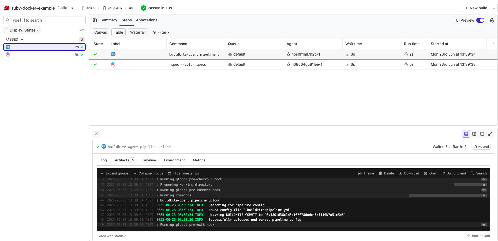

# Buildkite Ruby Docker Example

This repository is an example [Buildkite](https://buildkite.com/) pipeline that demonstrates how to test a [Ruby](https://www.ruby-lang.org/en/) project using [Docker](https://docker.com/).

👉 **See this example in action:** [buildkite/ruby-docker-example](https://buildkite.com/buildkite/ruby-docker-example/builds/latest?branch=main)

See the full [Getting Started Guide](https://buildkite.com/docs/guides/getting-started) for step-by-step instructions on how to get this running, or try it yourself:

<!-- docs:start -->

## How it works

This example:
- Uses the [Ruby Docker image](https://hub.docker.com/_/ruby/)
- Defines a [Docker Compose](https://docs.docker.com/compose/) service to run tests
- Uses a simple RSpec test suite for demonstration

Key files:
- [`Dockerfile`](Dockerfile) – defines the Ruby environment
- [`docker-compose.yml`](docker-compose.yml) – defines the app service
- [`pipeline.yml`](.buildkite/pipeline.yml) – uploads the pipeline

<!-- docs:end -->

## License

See [LICENSE.md](LICENSE.md) (MIT)
